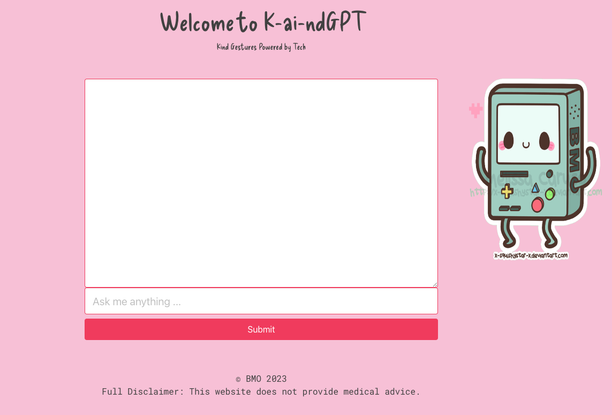

# Welcome to K-ai-ndGPT 🤖 💬 💖



#### Cloning and installation

- [ ] Clone this repo, navigate to it, install packages, and start the server with `npm run dev`
  <details style="padding-left: 2em">
    <summary>Tip</summary>

  ```sh
  cd k-ai-nd-GPT
  npm i
  npm run dev
  ```

  </details>
